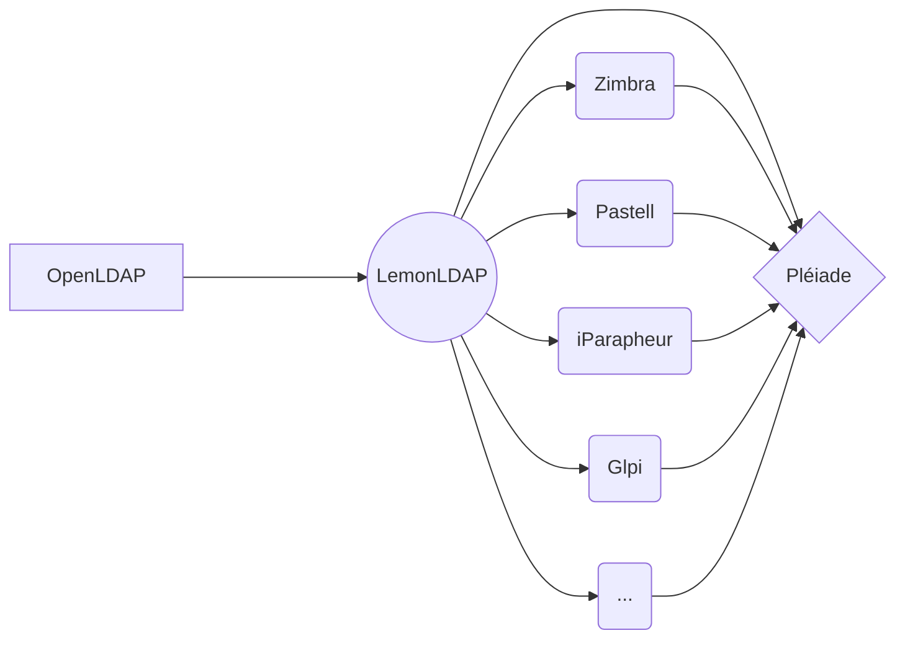

# Module Pléiade - Bureau virtuel

## Contexte

Ce module est développé pour fonctionner dans un contexte SSO (Single Sign On) avec LemonLDAP et les applications compatibles avec ce dernier.



L'objectif est de fournir à l'utilisateur un bureau virtuel qui affiche et formatte les informations métiers pour l'assister dans son travail quotidien.

## SSO, utilisateurs LDAP et Drupal

Méthodes d'authentification testées :

- [x] [CAS](https://www.drupal.org/project/cas)
- [x] [OpenID Connect](https://www.drupal.org/project/oidc)
- [ ] [SAML](https://www.drupal.org/project/samlauth) - en cours de tests

Les modules permettent une création automatique du compte utilisateur dans Drupal à sa première connexion, en utilisant les attributs exposés par LemonLDAP.


## Page d'administration

Une page permettant de paramétrer les urls/endpoints des différents applicatifs se trouve à :
```
/admin/config/api_lemon_pleiade/settings
```
## Appels des API LemonLDAP et des applicatifs compatibles

Les appels des API externes se font avec CURL.
Il faut s'assurer d'installer et activer le mod php-curl : 
```
apt install php-curl
phpenmod curl
```
### LemonLDAP

- [x] liste des applications de l'utilisateur
- [ ] historique des connexions de l'utilisateur
- [ ] paramètres TOTP / MFA

Exemple d'une requête complète vers LemonLDAP / Myapplications :
```
curl 'https://auth.mydomain.com/myapplications' -H 'User-Agent: Mozilla/5.0 (Windows NT 10.0; Win64; x64; rv:102.0) Gecko/20100101 Firefox/102.0' -H 'Accept: text/html,application/xhtml+xml,application/xml;q=0.9,image/avif,image/webp,*/*;q=0.8' -H 'Accept-Language: fr,fr-FR;q=0.8,en-US;q=0.5,en;q=0.3' -H 'Accept-Encoding: gzip, deflate, br' -H 'DNT: 1' -H 'Connection: keep-alive' -H 'Cookie: llnglanguage=fr; lemonldap=xxxxxxxxxxxxxxx' -H 'Upgrade-Insecure-Requests: 1' -H 'Sec-Fetch-Dest: document' -H 'Sec-Fetch-Mode: navigate' -H 'Sec-Fetch-Site: none' -H 'Sec-Fetch-User: ?1' -H 'Pragma: no-cache' -H 'Cache-Control: no-cache'
```
Le bureau virtuel récupère et affiche les catégories et applications auxquelles l'utilisateur a accès, sous forme de liens dans le menu latéral de gauche, et sous forme de blocs cliquables et déplaçables avec la librairie [SortableJS](https://github.com/SortableJS/Sortable)


### Inclusion de Javascript avec Drupal 9.x et problèmes liés

Voir : [core/jquery.once missing from header when library scoped to header depends on core/once](https://www.drupal.org/project/drupal/issues/3274688) et [Remove jQuery dependency from the once feature](https://www.drupal.org/node/3158256) 

### Zimbra

TODO

### Pastell

TODO
